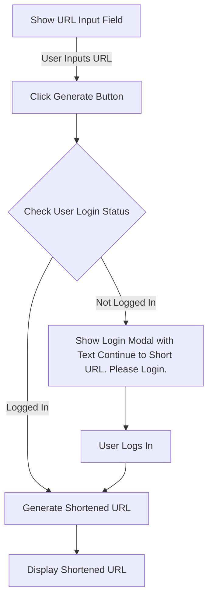

# Tiny Site Flow Documentation

## Shorten URL

### Overview

The following document outlines the flow for shortening URLs on the Tiny Site. This process involves user interaction with the website to input a URL, generate a shortened version, and display it to the user.

### Shorten URL Flow

The flowchart below illustrates the steps involved in shortening a URL on the Tiny Site.

### Step-by-Step Process

1. **Show URL Input Field:**

    - The user is presented with an input field to enter the URL they want to shorten.

2. **User Inputs URL:**

    - The user enters the desired URL into the input field.

3. **Click Generate Button:**

    - The user clicks the "Generate" button to initiate the URL shortening process.

4. **Check User Login Status:**

    - The system checks whether the user is logged in or not.

5. **Logged In:**

    - If the user is logged in, the system proceeds to generate the shortened URL.

6. **Not Logged In:**

    - If the user is not logged in, a login modal is displayed with a message: "Continue to Short URL. Please Login."

7. **Show Login Modal:**

    - The user has the option to log in within the modal.

8. **User Logs In:**

    - After successfully logging in, the system proceeds to generate the shortened URL.

9. **Generate Shortened URL:**

    - The system generates a unique shortened version of the entered URL.

10. **Display Shortened URL:**
    - The shortened URL is displayed to the user.

### Wireframes

-   [Excalidraw](https://excalidraw.com/#json=5Q2AIEiRs6DmMCaaoRN2N,zf9DD1Ln2AYgdGyLlSywiA)

### Conclusion

This flow outlines the user journey for shortening URLs on the Tiny Site, taking into account both logged-in and not-logged-in scenarios. The login modal ensures a smooth transition for users who need to log in before generating a shortened URL.
